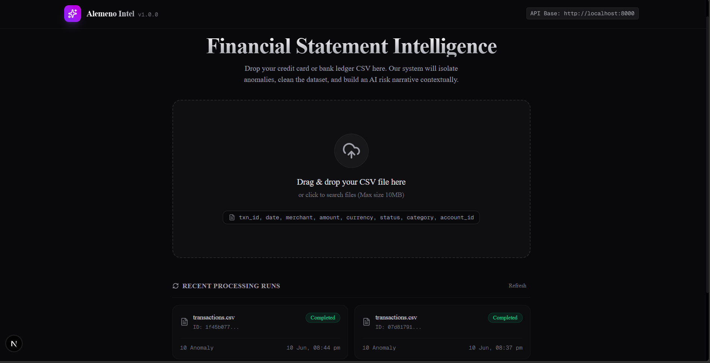
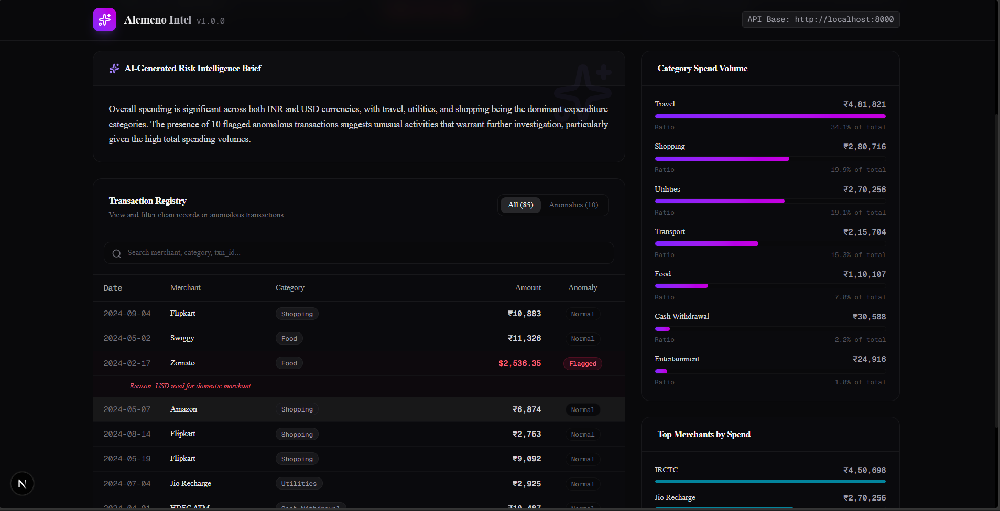
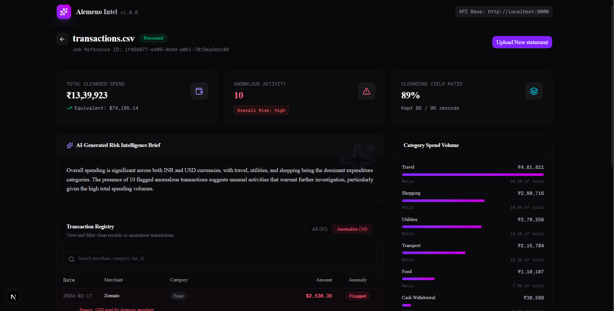
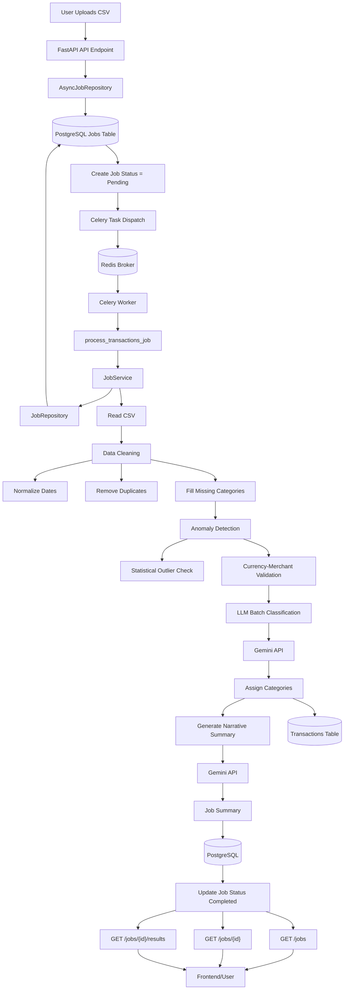
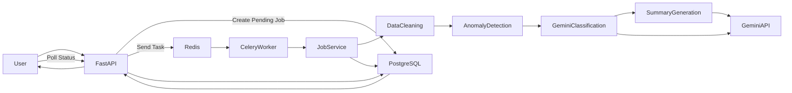
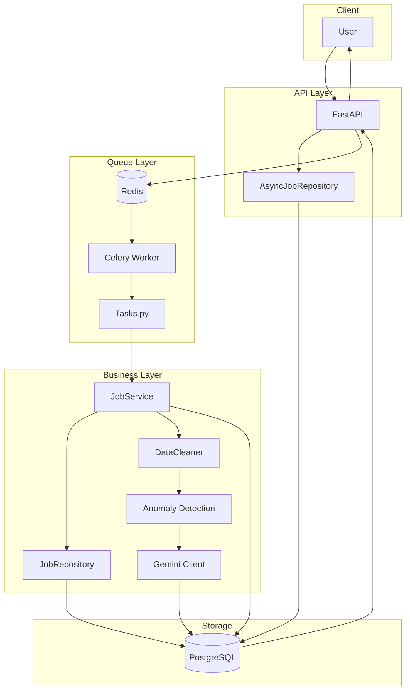

# Internship Submission: AI-Powered Transaction Processing & Anomaly Intelligence

This project is my submission for the **Alemeno Backend & DevOps Intern** assignment. It implements a complete, production-grade transaction processing system that ingests financial statements, processes them asynchronously, cleanses data, flags anomalies, categorizes missing fields via LLM, and displays them on a premium, dark-themed analytics dashboard.

---

## 📸 Client Views & Interface

Below are screenshots of the Next.js client interface developed for this assignment:

### 1. Main Analysis Dashboard
The main view provides executive metrics, overall risk indicators, and the AI narrative brief generated by the LLM pipeline:


### 2. Category Spend distribution
Visualizes spend distribution across categories (Food, Travel, Shopping, etc.) alongside top merchant rankings:


### 3. Flagged Anomaly Registry
Displays flagged anomalies in red highlighting the specific logic rules triggered and the reason details:


---

## ⚙️ Core Assignment Features

* **Complete Client-Server Connection**: Connected a Next.js client to the FastAPI backend using a centralized API layer at `client/lib/api.ts`.
* **Asynchronous Queue Ingestion**: Users drop a CSV into a drag-and-drop screen. The file is uploaded to Cloudflare R2 (or local fallback) and queued in a **Celery** pipeline with **Redis** as a broker.
* **Glowing Linear Gradient Progress**: While the statement is processing, the user is shown a progress tracker wrapped in an animated, glowing linear gradient border that polls the server for status updates.
* **Premium Dark Mode Styling**: Built using inline Tailwind CSS and manual Shadcn-styled components (Card, Badge, Progress, Table) in an aesthetic dark theme.
* **Sonner Toast Alerts**: Proper user-friendly notification triggers on upload start, upload success, and job completion.
* **Single Configuration Entrypoint**: The entire stack is managed from a single root `.env` file.

---

## 🚨 Anomaly Detection Logic & Rules

The anomaly detection engine analyzes transaction entries using two distinct filters:

### Rule 1: High Spend Outlier (> 3x median)
* **Logic**: Calculates the median spend amount for each distinct `account_id`. If a transaction's amount is greater than **3 times** that account's median, it is flagged as an anomaly.
* **Reason Tag**: `Amount > 3x account median`
* **Example**:
  * An account has transactions of ₹400, ₹450, and ₹500 (median = ₹450).
  * A transaction of **₹12,000** at Amazon on the same account is uploaded.
  * *Result*: Flagged as an anomaly because ₹12,000 > 3 × ₹450 (₹1,350).

### Rule 2: Domestic Merchant Currency Mismatch
* **Logic**: Domestic merchants (which primarily operate in India) should never have transactions charged in foreign currency. If the currency is `USD` and the merchant matches a local domestic brand (case-insensitively), it is flagged.
* **Monitored Domestic Merchants**: `swiggy`, `ola`, `irctc`, `zomato`, `rapido`, `meesho`.
* **Reason Tag**: `USD used for domestic merchant`
* **Example**:
  * A transaction at **Zomato** (or **Swiggy**) is processed for **$75.00 USD**.
  * *Result*: Flagged as an anomaly because Zomato is a domestic service and was billed in USD instead of INR.

---


### Request Lifecycle
1. **Upload**: The user uploads a statement. FastAPI performs validations (file extension, empty check, missing columns, <= 10MB size) and writes it to storage.
2. **Queue**: A Celery task is dispatched (`process_transactions_job`).
3. **Cleanse**: The worker parses dates to ISO `YYYY-MM-DD`, strips currency signs, uppercases statuses/currencies, and deduplicates exact rows.
4. **Detect**: The custom anomaly rules filter outliers and foreign currency mismatches.
5. **Classify**: Uncategorized items are batched and classified using the Gemini API.
6. **Summarize**: Gemini generates an executive risk brief. If Gemini rate limits are hit, a **graceful fallback** narrative is populated so the pipeline successfully finishes without crashing.
7. **View**: The Next.js client transitions from a glowing processing loader into the dashboard.

---

## 🛠️ Tech Stack & Dependencies

* **Frontend**: Next.js 16 (App Router), React 19, Tailwind CSS v4, Lucide Icons, Sonner Toasts
* **API Framework**: FastAPI, Uvicorn, SlowAPI (Redis-backed rate limiter)
* **Task Queues**: Celery, Redis
* **Database & Migration**: PostgreSQL 15, SQLAlchemy (Async pg connection support), Alembic
* **Cloud Storage**: Cloudflare R2 / boto3 S3-compatible SDK
* **Analytics & AI**: Pandas, Google Gemini API SDK (`gemini-2.5-flash`)

---
## 🏗️ System Architecture


---

### Cleaner Version



---

### Architecture Diagram with Components



## 🚀 How to Run the Project

### 1. Clone & Set Up Configuration
Clone the repository and copy the environment variables template:
```bash
git clone https://github.com/sidhyaashu/Alemeno.git
cd Alemeno
cp .env.example .env
```

Open `.env` and configure your keys (Gemini API Key and Cloudflare R2 keys):
```env
GEMINI_API_KEY=AIzaSy...
GEMINI_MODEL=gemini-2.5-flash

R2_ACCOUNT_ID=...
R2_ACCESS_KEY_ID=...
R2_SECRET_ACCESS_KEY=...
R2_BUCKET_NAME=...
```

*Note: The pipeline works even without a Gemini API key or R2 credentials. The system will fall back to local disk storage and write automated rule narratives if Gemini is unavailable.*

### 2. Start the Docker Stack
Run the following command to build and launch all containers in detached mode:
```bash
docker compose up --build -d
```
Docker will initialize:
- **db**: PostgreSQL database (with Alembic automatic migrations run)
- **redis**: Task queue broker
- **api**: FastAPI backend server (http://localhost:8000)
- **worker**: Celery worker executing pipeline tasks
- **client**: Next.js frontend application (http://localhost:3000)

### 3. Verify in Browser
- Open **http://localhost:3000** to access the dashboard.
- Upload the provided sample file: [test_transactions.csv](test_transactions.csv) located in the project root to run a complete test parse.

---

## 🧪 Testing Suite
To execute the automated unit and integration tests:
```bash
# Run tests inside the server folder
cd server
pip install -r requirements.txt
pytest tests/ -v
```
Tests cover date formats, amount parsing, category replacement, anomaly checks (3x median and Zomato/Swiggy USD charges), and API validations (empty files, wrong extensions, 404 handler responses).
